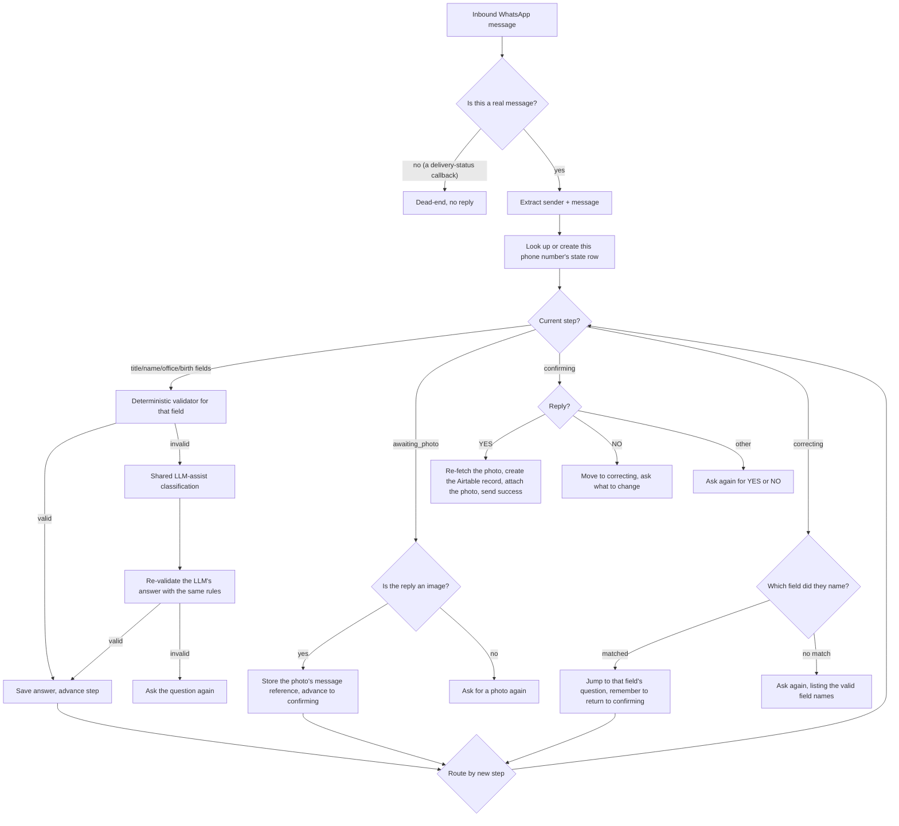

# Architecture

See `README.md` for the project overview.

**Build status:** the full conversation flow described below is built and has passed structural validation and internal review. It has **not yet been exercised by a real end-to-end WhatsApp conversation with a live member.** Treat every step as "built, pending live verification" rather than "proven in production."

## Overview

A WhatsApp-native registration bot, built as a single workflow in a workflow-automation engine (n8n), backed by a relational database (Postgres) that holds each registrant's progress as plain columns rather than relying on an AI model's own memory of the conversation. The database is the single source of truth for "what step is this person on and what have they told us so far." The AI model, where it appears at all, is used narrowly and only when a deterministic rule can't classify an answer.

## Components

- **Messaging channel.** WhatsApp Cloud API, via its native trigger. Delivers inbound messages (text and photos) and is used to send every reply.
- **Workflow engine.** Orchestrates the whole conversation: routes each inbound message by the registrant's current step, runs validation, updates state, decides what to send next.
- **State store.** A Postgres table, one row per phone number, one column per collected field plus a `current_step` marker and a `return_step` marker (used only during a correction).
- **Reasoning layer.** A single-purpose LLM call, used only as a fallback when a deterministic rule can't classify a free-text answer (e.g. a birth month written unusually). Its output is re-validated by the same deterministic rules before being trusted, never accepted blindly.
- **Record store.** Airtable, the system of record for a completed registration, including the member's photo as a real file attachment.

## Conversation flow

## Data flow for the photo, specifically

The photo is never held in the database as a file. What's stored is a reference to the exact inbound WhatsApp message that contained it (valid for a limited window). At the point registration is confirmed, that reference is used to fetch the real file fresh and attach it to the newly created record, so the photo that ends up on file is guaranteed to be the one that specific person actually sent, not a filename guessed from a naming convention.

## What this deliberately avoids

- No conversation state lives only in an AI model's memory: a restart, a long gap, or a model change can't lose someone's progress.
- No external, third-party-hosted web page in the registration flow: the photo step never leaves WhatsApp.
- The reasoning layer's output is never trusted directly; it's always re-checked by the same rules a normal answer would face.
